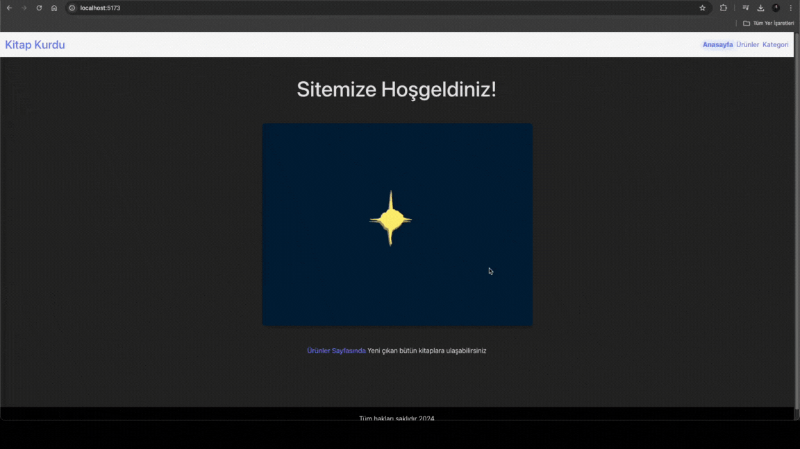

# BookShop

- This project is a simple book application built using React, Vite, and React Router. It demonstrates navigation between different pages, displaying product lists with detailed information, and handling 404 errors using React Router.

## Libraries used

- Axios
- Bootstrap
- React Router Dom
- Json Server

## GIF

# bookStore
